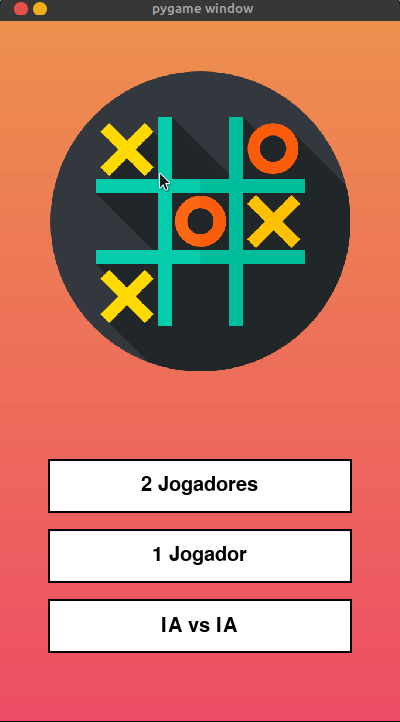

  

# Cleaning Robot Simulation

  

Introduction
This project simulates a cleaning robot operating in a predefined environment. The robot can be either a simple robot with a fixed path or a complex robot capable of finding and cleaning garbage in its surroundings. The simulation is implemented in Python using the Pygame library for graphical representation.
## Simulation Details
### Simple Robot Mode
In this mode, a simple robot follows a predefined fixed path to navigate through the environment. The robot moves in a pattern, cleaning any garbage it encounters along the way.

### Complex Robot Mode
In this mode, a complex robot actively searches for garbage in its environment and calculates the shortest path to the nearest garbage. The robot then moves to that location, cleans the garbage, and repeats the process until all garbage is cleaned.

---
# Tic-Tac-Toe with AI

  

This is a simple implementation of the classic Tic-Tac-Toe game with an artificial intelligence (AI) opponent, built using Python and the pygame library. The game offers multiple playing modes, including Player vs. Player, Player vs. AI, and AI vs. AI. The graphical user interface is designed using pygame to provide an interactive gaming experience.

## Features:

- **Multiple Game Modes:**
  - **Player vs. Player:** Two human players take turns making moves.
  - **Player vs. AI:** Play against a computer opponent with a basic AI strategy.
  - **AI vs. AI:** Watch two AI opponents compete against each other.

- **Score Tracking:**
  - The game keeps track of victories for each player (X and O) and the number of ties.

- **Responsive User Interface:**
  - The graphical interface is designed to be user-friendly and responsive, providing a seamless gaming experience.

Feel free to explore and modify the code to enhance or customize the game according to your preferences. Happy gaming!

### Contribuidores 
  <table align="center">
  <tr>
    <td align="center">
      <a href="#">
         
        
            
        
      </a>
    </td>
    <td align="center">
      <a href="#">
         
        
           
        
      </a>
    </td>
  </tr>
</table>
