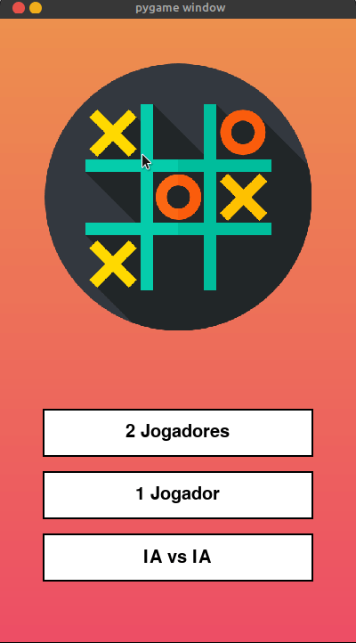

<p align="center">
  
</p>

# Tic-Tac-Toe with AI

<p align="center">
  
</p>

This is a simple implementation of the classic Tic-Tac-Toe game with an artificial intelligence (AI) opponent, built using Python and the pygame library. The game offers multiple playing modes, including Player vs. Player, Player vs. AI, and AI vs. AI. The graphical user interface is designed using pygame to provide an interactive gaming experience.

## Features:

- **Multiple Game Modes:**
  - **Player vs. Player:** Two human players take turns making moves.
  - **Player vs. AI:** Play against a computer opponent with a basic AI strategy.
  - **AI vs. AI:** Watch two AI opponents compete against each other.

- **Score Tracking:**
  - The game keeps track of victories for each player (X and O) and the number of ties.

- **Responsive User Interface:**
  - The graphical interface is designed to be user-friendly and responsive, providing a seamless gaming experience.

## How to Play:

1. Run the script to launch the game.
2. Choose the desired game mode from the main menu.
3. Follow on-screen instructions to make moves or watch the AI play.
4. The game will automatically keep track of wins and ties.

## Dependencies:

- Python 3.x
- pygame library

## How to Run:

1. Install the required dependencies using:
   ```bash
   pip install pygame
   ```
2. Execute the script:
   ```bash
    python game.py
   ```
Feel free to explore and modify the code to enhance or customize the game according to your preferences. Happy gaming!

### Contribuidores<br>
  <table align="center">
  <tr>
    <td align="center">
      <a href="#">
        <br>
        <sub>
            <a href="https://github.com/Luis-kuhn" ></a>
        </sub>
      </a>
    </td>
    <td align="center">
      <a href="#">
        <br>
        <sub>
           <a href="https://github.com/thrnkk" ></a>
        </sub>
      </a>
    </td>
  </tr>
</table>
